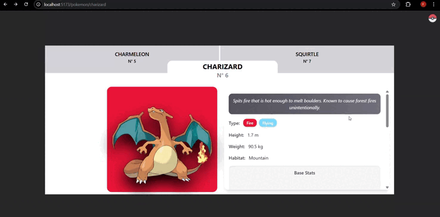

# Pokémon API App

## Description
This project is a simple web application that consumes the [PokéAPI](https://pokeapi.co/) to display Pokémon data.  
It is currently in the early stages of development, focusing on learning how to work with APIs and React components.

## Tech Stack
- **React** – Frontend framework  
- **TailwindCSS** – Styling  
- **PokéAPI** – Data source  
- **Lucide** - Icons
- **React-router-dom** - Declarative routing for React web applications

## Status
🚧 **Work in progress** – more features will be added soon.
